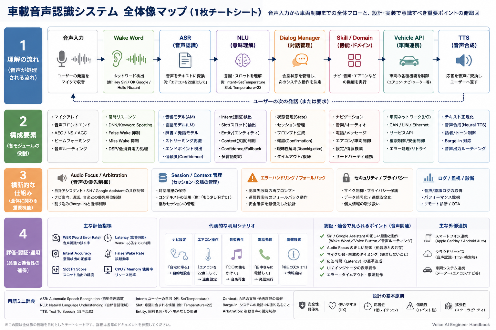

# Voice AI Engineer Handbook

車載音声認識エンジニア向けに、読む教材・演習教材・設計レビュー教材・AI家庭教師を兼ねる学習基盤です。

## 目的

- 車載音声認識の全体像を理解する。
- ASR / NLU / Dialog Manager / TTS / Wake Word を説明できるようにする。
- CarPlay / Android Auto / Siri / Google Assistant 連携時に音声チームが意識すべき認証観点を理解する。
- 設計レビュー、ログ解析、品質評価の基本観点を身につける。
- 生成AIを使ってクイズ・演習・レビュー問題を作れるようにする。

## 対象読者

- 車載音声認識プロジェクトに参加する新任エンジニア
- HMI、Audio、Navigation、Vehicle Integration と連携する開発者
- 音声機能の品質評価、ログ解析、設計レビューを担当する人
- 生成AIを学習支援やレビュー支援に使いたい人

## 四層構造

### Layer 1: 全体俯瞰
- A4一枚チートシート
- 車載音声認識の全体フローを把握する

### Layer 2: 体系学習
- Markdown教材
- ASR / NLU / Dialog / TTS / 車載連携を順番に学ぶ

### Layer 3: 実践演習

- [章別クイズ](quizzes/README.md)
- ケーススタディ
- 設計レビュー
- 不具合解析

### Layer 4: AI家庭教師

- AGENTS.md
- prompts/
- 生成AIに説明、出題、レビューをさせる

## 全体像マップ

この1枚チートシートは、音声入力から車両制御までの処理フロー、構成要素、横断的な仕組み、評価・認証・運用観点を俯瞰するための入口です。詳細は `docs/` の各章で確認してください。

## 学習ロードマップ

1. `diagrams/voice-ai-overview.md` と `cheatsheets/voice-ai-review.md` で全体像とレビュー観点を把握する。
2. `docs/00_learning-roadmap.md` で学習順序と到達目標を確認する。
3. `docs/01_overview.md` から `docs/13_llm-integration.md` まで順番に読む。
4. 各章の確認問題と[章別クイズ](quizzes/README.md)で理解を確認する。
5. [`exercises/`](exercises/README.md)で設計・解析の練習をする。
6. `AGENTS.md`と`prompts/`を使い、AIに追加問題やレビューを依頼する。

## 各章一覧

- `00_learning-roadmap.md`: 学習順序と到達目標
- `01_overview.md`: 車載音声認識の全体フロー
- `02_audio-basics.md`: 音声信号と車載マイクの基礎
- `03_wake-word.md`: Wake Word と誤起動・未起動
- `04_asr.md`: 音声をテキストに変換するASR
- `05_nlu.md`: Intent / Slot / Context を扱うNLU
- `06_dialog-manager.md`: 会話状態を管理するDialog Manager
- `07_tts.md`: 応答を音声化するTTS
- `08_vehicle-integration.md`: 車両機能・Vehicle APIとの連携
- `09_audio-focus-and-arbitration.md`: Audio Focus と競合制御
- `10_certification.md`: 外部アシスタント連携と認証観点
- `11_metrics.md`: 評価指標とログ取得
- `12_architecture.md`: 車載音声システムのアーキテクチャ
- `13_llm-integration.md`: LLM連携の可能性と注意点
- `glossary.md`: 用語集

## AIを使った学習方法

- [`prompts/README.md`](prompts/README.md)で用途と使い方を確認する。
- [`generate_quiz.md`](prompts/generate_quiz.md)で章ごとの理解度確認問題を生成する。
- [`generate_review.md`](prompts/generate_review.md)で設計案のレビュー観点を洗い出す。
- [`explain_beginner.md`](prompts/explain_beginner.md)で難しい章を初心者向けに説明し直す。
- [`generate_design_exercise.md`](prompts/generate_design_exercise.md)で設計演習を生成する。
- [`interview.md`](prompts/interview.md)で段階的な面接練習を行う。
- `AGENTS.md`の役割定義を使い、教師・レビューア・面接官としてAIを使い分ける。

## 教材を追加する場合

- [`templates/README.md`](templates/README.md)から、章、クイズ、演習、設計レビューのテンプレートを選ぶ。
- `<...>`を対象内容へ置き換え、既存教材へのリンクと関連ID・ログ観点を追加する。

## チートシート

- [`voice-ai-review.md`](cheatsheets/voice-ai-review.md): 車載Voice AIの評価、ログ、レビュー観点
- [`nlu-cheatsheet.md`](cheatsheets/nlu-cheatsheet.md): Intent、Slot、Contextと曖昧性の扱い
- [`dialog-cheatsheet.md`](cheatsheets/dialog-cheatsheet.md): State、Session、Timeoutと状態遷移
- [`certification-cheatsheet.md`](cheatsheets/certification-cheatsheet.md): 外部アシスタント連携と認証確認事項

## 演習の進め方

1. まず自分で仮説を書く。
2. 章の本文とチートシートを見て観点漏れを補う。
3. AIにヒントを依頼する。ただし最初から模範解答を求めない。
4. 設計レビューでは、機能・品質・ログ・認証・安全性・運用を分けて確認する。

## 注意事項

- 本教材は公開情報と一般的な実務観点に基づく学習資料です。
- 社外秘情報、特定企業の非公開仕様、認証手順の詳細は扱いません。
- CarPlay / Android Auto / Siri / Google Assistant の詳細仕様は、必ず公式・契約上参照可能な資料で確認してください。
