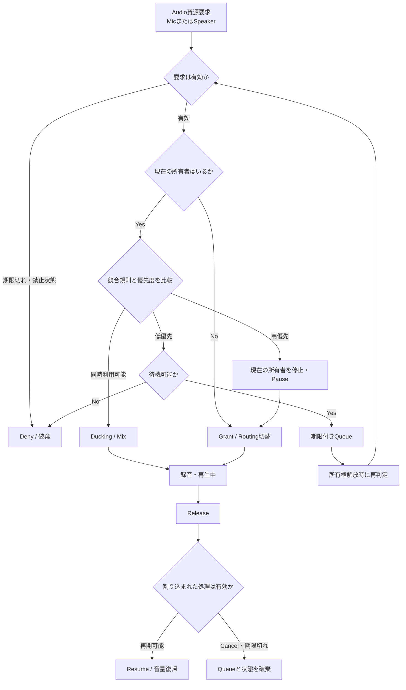

# Audio FocusとArbitration

複数機能がマイクまたはスピーカーを要求した場合の調停フローです。詳細は[Audio FocusとArbitration](../docs/09_audio-focus-and-arbitration.md)を参照してください。

## 競合規則で定義すること

- 警告音、通話、ナビ、音楽、外部Assistant、自社Assistantの優先関係
- Stop、Pause、Ducking、Mix、Queue待ちの選択
- Grant前の利用禁止と、Releaseする主体
- 割り込み後のResume、再要求、破棄
- CancelとGrantの競合、所有Process停止時の回収

ログには要求ID、所有者、優先度、判定、Routing、Grant・Release時刻、復帰結果を残します。
