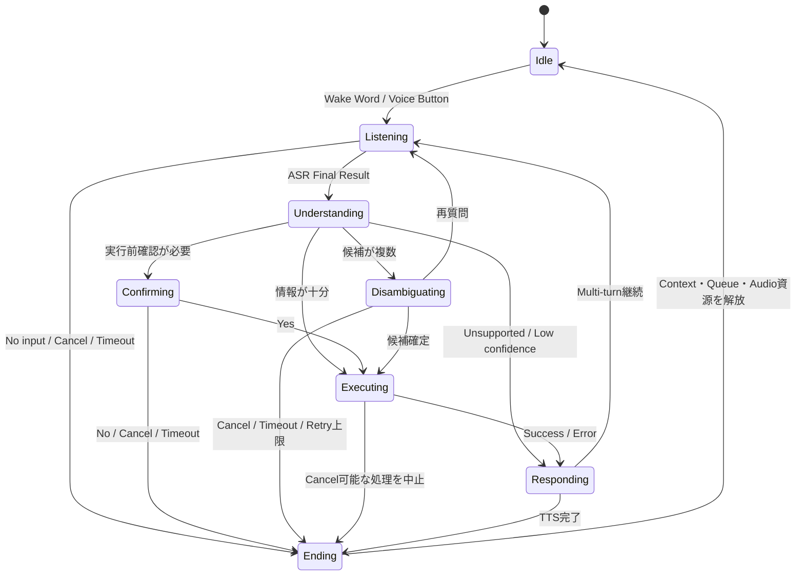

# Dialog State

対話Sessionの代表的な状態遷移です。詳細は[Dialog Manager](../docs/06_dialog-manager.md)を参照してください。

## 遷移に必ず持たせる情報

- Session ID、Request ID
- 遷移前State、Event、遷移後State、理由
- StateごとのTimeoutとRetry上限
- Contextと候補の生成・失効条件
- 遅延した非同期応答の採用・破棄条件

レビュー項目は[Dialog Managerチートシート](../cheatsheets/dialog-cheatsheet.md)を参照してください。
