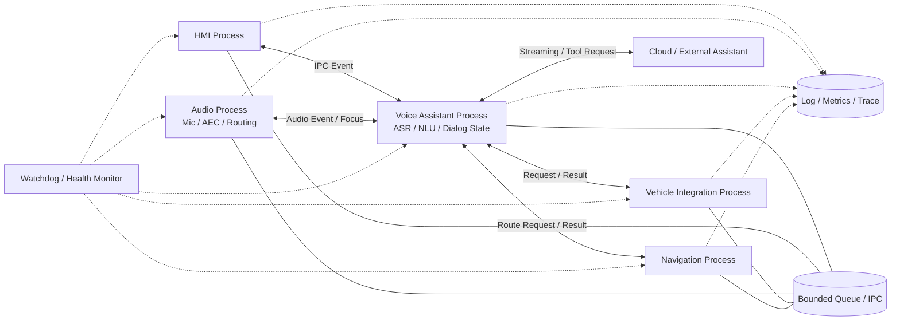

# 車載Voice AIのプロセス構成

論理Pipelineを複数Processへ分離する場合の一例です。詳細は[アーキテクチャ](../docs/12_architecture.md)を参照してください。

## 境界ごとに確認すること

- IPCメッセージの版、Session ID、Request ID、期限
- Queue上限、順序保証、重複排除、Backpressure
- StateとAudio資源の所有者
- Timeout、Retry、Idempotency、Circuit Breaker
- Watchdogの検知条件とProcess再起動後の初期化
- Correlation IDによるProcess横断のログ追跡

この図は構成例です。Process分離は障害分離、権限、性能、更新単位に応じて判断します。
