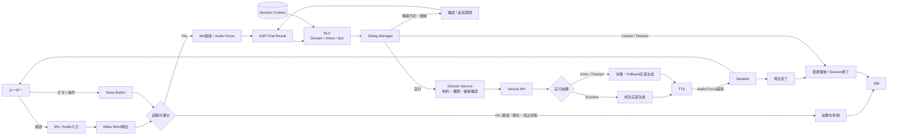

# Voice AI全体フロー

Wake WordまたはVoice Buttonによる起動から、車両実行結果をTTSで返すまでの論理フローです。詳細は[車載音声認識の全体像](../docs/01_overview.md)を参照してください。

## 読み方

- Wake WordとVoice Buttonは、どちらもSession開始の入口です。
- ASRは文字列、NLUは意味構造、Dialog Managerは次Actionを決めます。
- Domain Serviceは、LLMやNLUの結果をそのまま実行せず、制約と権限を検証します。
- Vehicle APIへの送信成功と車両での実行成功は区別します。
- TTS合成完了と再生完了を区別し、通常時は再生完了後にAudio Focusを解放します。
- Cancel、Timeout、Errorでも、Mic、Audio Focus、Contextを整理してIdleへ戻します。

レビュー項目は[Voice AIレビュー・チートシート](../cheatsheets/voice-ai-review.md)を参照してください。
